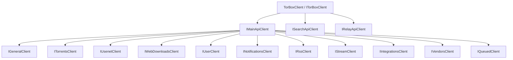

# Architecture Overview

This guide is for integrators and contributors who want to understand the public SDK shape.

## Client hierarchy

## API families

- **Main API**: the largest surface, split into 11 resource clients
- **Search API**: search-oriented endpoints for torrents, usenet, metadata, Torznab, and Newznab
- **Relay API**: relay status and inactivity checks

## Cross-cutting behavior

- Authentication uses a Bearer token attached by an internal `DelegatingHandler`
- JSON serialization uses `System.Text.Json` with `snake_case` naming
- Responses use the standard `TorBoxResponse` envelope
- API failures are surfaced through `TorBoxException`
- DI registration uses `IHttpClientFactory` through `AddTorBox()`

## Why this structure exists

The SDK keeps the root API simple:

- `ITorBoxClient` for full-platform access
- `IMainApiClient` for Main API grouping
- focused resource clients for day-to-day endpoint usage

This helps keep IntelliSense discoverable while still covering the full TorBox API surface.
