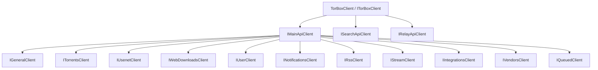

# Architecture Overview

This guide is for integrators and contributors who want to understand the public SDK shape.

## Client hierarchy



## API families

- **Main API**: the largest surface, split into 11 resource clients
- **Search API**: search-oriented endpoints for torrents, usenet, metadata, Torznab, and Newznab
- **Relay API**: relay status and inactivity checks

## DI and instantiation

`AddTorBox()` registers only `ITorBoxClient` in the DI container. All sub-clients (`MainApiClient`, `SearchApiClient`, `RelayApiClient`, and resource clients like `TorrentsClient`) are `internal` and instantiated by `TorBoxClient` itself. They are **not** individually resolvable from the service provider.

```csharp
// Correct — resolve the root client
ITorBoxClient client = provider.GetRequiredService<ITorBoxClient>();
client.Main.Torrents   // access resource clients through the hierarchy
client.Search          // access Search API
client.Relay           // access Relay API

// These return null — sub-clients are not registered individually
provider.GetService<IMainApiClient>();     // null
provider.GetService<ISearchApiClient>();   // null
```

## Cross-cutting behavior

- Authentication uses a Bearer token attached by an internal `DelegatingHandler`
- JSON serialization uses `System.Text.Json` with `snake_case` naming
- Responses use the standard `TorBoxResponse` envelope
- API failures are surfaced through `TorBoxException`
- DI registration uses named `HttpClient` pipelines through `IHttpClientFactory` via `AddTorBox()`

## Why this structure exists

The SDK keeps the root API simple:

- `ITorBoxClient` is the single entry point and the only type exposed via DI
- `IMainApiClient` groups Main API resource clients
- focused resource clients for day-to-day endpoint usage

All concrete client implementations are `internal`. Users always go through `ITorBoxClient` to access any SDK functionality. This helps keep IntelliSense discoverable while still covering the full TorBox API surface.
