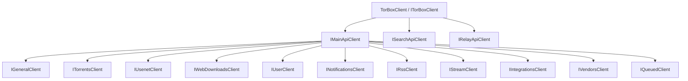

# Architecture Overview

This guide is for integrators and contributors who want to understand the public SDK shape.

## Client hierarchy



## API families

- **Main API**: the largest surface, split into 11 resource clients
- **Search API**: search-oriented endpoints for torrents, usenet, metadata, Torznab, and Newznab
- **Relay API**: relay status and inactivity checks

## Instantiation

<xref:TorBoxSDK.DependencyInjection.TorBoxServiceCollectionExtensions.AddTorBox*> registers only <xref:TorBoxSDK.ITorBoxClient> in the DI container. All sub-clients (`MainApiClient`, `SearchApiClient`, `RelayApiClient`, and resource clients like `TorrentsClient`) are `internal` and instantiated by <xref:TorBoxSDK.TorBoxClient> itself. They are **not** individually resolvable from the service provider.

```csharp
// Correct — resolve the root client
ITorBoxClient client = provider.GetRequiredService<ITorBoxClient>();
client.Main.Torrents   // access resource clients through the hierarchy
client.Search          // access Search API
client.Relay           // access Relay API

// These return null — sub-clients are not registered individually
provider.GetService<IMainApiClient>();     // null
provider.GetService<ISearchApiClient>();   // null
```

<xref:TorBoxSDK.TorBoxClient> also supports standalone instantiation when dependency injection is not needed:

```csharp
using TorBoxClient client = new("your-api-key");

using TorBoxClient configuredClient = new(new TorBoxClientOptions
{
    ApiKey = "your-api-key",
    Timeout = TimeSpan.FromSeconds(60)
});

using TorBoxClient builtClient = new(options =>
{
    options.ApiKey = "your-api-key";
    options.Timeout = TimeSpan.FromSeconds(60);
});
```

The DI-focused constructor is marked with `[ActivatorUtilitiesConstructor]` so ASP.NET Core and other `Microsoft.Extensions.DependencyInjection` consumers choose the `IHttpClientFactory` + `IOptions<TorBoxClientOptions>` path automatically when resolving `ITorBoxClient`.

<xref:TorBoxSDK.TorBoxClient> implements `IDisposable`. In standalone mode, it owns and disposes the underlying `HttpClient` instances, so it should be wrapped in a `using` statement. In DI mode, `Dispose()` is a no-op because the container manages the HTTP client lifecycle.

## Cross-cutting behavior

- Authentication uses a Bearer token attached by an internal `DelegatingHandler`
- JSON serialization uses `System.Text.Json` with `snake_case` naming
- Responses use the standard <xref:TorBoxSDK.Models.Common.TorBoxResponse`1> envelope
- API failures are surfaced through <xref:TorBoxSDK.TorBoxException>
- DI registration uses named `HttpClient` pipelines through `IHttpClientFactory` via `AddTorBox()`

## Why this structure exists

The SDK keeps the root API simple:

- <xref:TorBoxSDK.ITorBoxClient> is the single entry point and the only type exposed via DI
- <xref:TorBoxSDK.Main.IMainApiClient> groups Main API resource clients
- focused resource clients for day-to-day endpoint usage

All concrete client implementations are `internal`. Users always go through <xref:TorBoxSDK.ITorBoxClient> to access any SDK functionality. This helps keep IntelliSense discoverable while still covering the full TorBox API surface.
