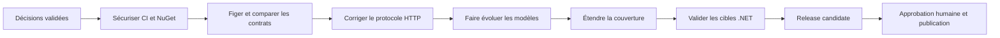

# Plan de modernisation de TorBoxSDK

> État : document de travail — 10 août 2026<br>
> Référence locale auditée : `v1.0.0` / commit `fd2acda`<br>
> Branche de documentation : `codex/sdk-modernization-plan`<br>
> Les décisions DEC-001 à DEC-005 et DEC-020 sont validées. Toutes les autres options restent non adoptées tant qu'elles ne sont pas validées dans [Décisions à valider](decisions.md).

## Objectif

Faire évoluer TorBoxSDK pour qu'il représente fidèlement les API officielles TorBox, sans compromettre les consommateurs actuels du package NuGet. Le chantier doit couvrir en même temps :

- les routes, paramètres, contenus HTTP et formes de réponse réellement exposés ;
- des modèles capables d'évoluer lorsque TorBox ajoute des champs ;
- une politique .NET explicite, testée et publiable ;
- une chaîne de tests reproductible, indépendante des fluctuations de la spécification distante ;
- une publication NuGet contrôlée, vérifiable et récupérable en cas d'incident.

Ce document est un plan d'exécution. Il n'autorise ni rupture d'API publique, ni choix de frameworks cibles, ni publication.

## Résumé de l'audit

### État de la publication

- La seule version NuGet observée est `1.0.0`, publiée le 24 avril 2026.
- Le tag `v1.0.0` et le commit SDK audité désignent `fd2acda`. La branche
  `master` pointe désormais sur `1951c26`, qui ajoute uniquement la migration
  des agents/skills Copilot vers Codex sans modifier le code du SDK publié.
- `Directory.Build.props` fixe actuellement `Version` à `1.0.0`.
- le flux de publication se déclenche manuellement à partir d'un tag `v*`, construit puis envoie immédiatement le package avec `--skip-duplicate` ;
- aucun test ne constitue aujourd'hui un prérequis de ce flux.

Conséquence : créer un tag `v1.1.0` sans modifier la propriété `Version` pourrait reconstruire `TorBoxSDK.1.0.0.nupkg`, puis `--skip-duplicate` pourrait masquer l'erreur au lieu d'échouer. Le flux de publication doit donc être sécurisé avant toute nouvelle version.

### État du contrat officiel

L'URL officielle `https://api.torbox.app/openapi.json` ne renvoie pas toujours le même document. Pendant l'audit, deux variantes ont été servies :

| Variante observée | Routes | Opérations | Schémas | Différence principale |
|---|---:|---:|---:|---|
| A | 87 | 93 | 36 | pas de gestion des moteurs de recherche ; `subscribed_email_segments` présent |
| B | 91 | 97 | 42 | quatre routes de moteurs de recherche et six schémas associés ; `subscribed_email_segments` absent |

Les réponses JSON `200` des opérations de l'API principale n'ont pas de schéma exploitable dans les variantes observées. La spécification permet donc d'auditer les requêtes, mais ne suffit pas à générer des modèles de réponse fiables.

Les constats détaillés et le traitement proposé figurent dans [Contrat API et modèles](api-contract-and-models.md).

### État des tests

- Tests unitaires : 491 réussites sur le framework utilisé lors de l'audit (`net10.0`).
- Tests OpenAPI : une exécution a produit 98 réussites et 13 échecs, essentiellement parce que les tests ont reçu l'une des deux variantes distantes.
- Tests en direct : 6 réussites et 16 échecs dans l'environnement local configuré ; la majorité des échecs sont des réponses `403`, avec une réponse `404` pour Search.

Ces résultats ne signifient pas que le SDK est sûr à publier : les tests unitaires valident surtout le comportement déjà implémenté, tandis que les tests de contrat et en direct ne sont pas suffisamment déterministes pour servir de barrière de publication.

### État de la compatibilité .NET

Le package cible actuellement `net6.0`, `net7.0`, `net8.0`, `net9.0` et `net10.0`. Au 10 août 2026 :

- .NET 6 et .NET 7 ne sont plus pris en charge par Microsoft ;
- .NET 8 LTS et .NET 9 STS sont encore en maintenance jusqu'au 10 novembre 2026 ;
- .NET 10 LTS est actif jusqu'au 14 novembre 2028.

Multiplier les frameworks ne garantit pas à lui seul la compatibilité la plus large. `netstandard2.0` pourrait étendre la portée à .NET Framework et à d'autres implémentations, mais impose un audit du code, des dépendances et de la surface publique. Les options, sans choix implicite, sont comparées dans [Compatibilité .NET](dotnet-compatibility.md).

## Principes de conduite du chantier

1. **Aucune publication depuis un état non reproductible.** Les spécifications utilisées par les tests doivent être versionnées et leur provenance enregistrée.
2. **Aucune décision produit implicite.** Toute rupture, cible .NET, stratégie de génération, organisation de package ou exposition d'une API instable est soumise à validation.
3. **Les corrections du protocole précèdent l'extension de surface.** Une route déjà exposée mais envoyant un mauvais type de contenu est plus dangereuse qu'une route encore absente.
4. **La compatibilité se mesure sur le package construit.** La compilation du dépôt ne remplace ni la validation du package, ni l'installation dans des projets consommateurs.
5. **Les tests distants sont des signaux, pas la seule source de vérité.** Les tests reproductibles reposent sur des instantanés, des fixtures et des doubles HTTP ; les tests en direct complètent ces contrôles.
6. **NuGet est immuable.** Une version défectueuse ne peut pas être remplacée. Le plan de retour consiste à déprécier ou délister la version puis publier un correctif.

## Organisation du travail avec Git et les worktrees

La documentation est préparée dans un worktree distinct, sans modification de `master` :

```text
TorBoxSDK                         master, état utilisateur inchangé
TorBoxSDK-docs-modernization      codex/sdk-modernization-plan
TorBoxSDK-v2                      v2.0.0, intégration locale de la v2
```

La branche `v2.0.0` a été créée depuis le commit documentaire validé
`67e7253`. Son [guide de développement](v2-development-workflow.md) définit
le cadre local applicable tant que DEC-018 n'a pas fixé la stratégie
d'intégration et de tags définitive.

Après validation du plan, chaque lot doit rester borné et isolé. Les noms ci-dessous sont des exemples de découpage, pas des branches déjà décidées :

```text
codex/release-safety
codex/openapi-snapshots
codex/request-wire-fixes
codex/model-evolution
codex/api-coverage
codex/dotnet-targets
```

Règles de travail proposées, à appliquer après validation :

- un worktree par lot et une seule responsabilité par branche ;
- point de départ identifié par commit, et rebasage ou fusion décidés avant intégration ;
- aucun fichier partagé modifié simultanément sans coordination, notamment les fichiers de projet, les options JSON et les flux CI ;
- aucun tag de publication créé depuis une branche de travail ;
- intégration dans l'ordre des dépendances : sécurité de publication, contrat reproductible, corrections HTTP, modèles, couverture, cibles .NET, release candidate ;
- suppression des worktrees uniquement après intégration et vérification de l'absence de changements locaux.

## Feuille de route conditionnelle



### Phase 0 — Valider les décisions bloquantes

Entrée : audit et documentation relus.<br>
Travail : DEC-001 à DEC-005 et DEC-020 sont désormais renseignées dans [Décisions à valider](decisions.md). La ligne 2.0, la matrice .NET, la génération interne, le contrat vérifié en live et le statut restreint de Search sont approuvés.<br>
Sortie : décisions restantes validées au moment où leur lot devient actif ; aucun choix implicite.

### Phase 1 — Sécuriser le dépôt et la publication

Livrables :

- contrôles obligatoires sur pull request ;
- version du package dérivée d'une source unique et comparée au tag ;
- tests exécutés avant `pack`, puis validation du `.nupkg` exact avant envoi ;
- validation de compatibilité du package par rapport à `1.0.0` ;
- publication protégée par une approbation et sans masquage d'un doublon inattendu.

Critère de sortie : il est impossible de pousser un package dont la version diffère du tag, ou un package qui n'a pas traversé les contrôles documentés.

### Phase 2 — Rendre le contrat reproductible

Livrables :

- instantanés datés et hachés des spécifications Main, Search et Relay effectivement retenues ;
- rapport machine des routes, paramètres, types de contenu et champs ajoutés/supprimés ;
- séparation entre tests reproductibles sur instantané et surveillance distante ;
- procédure de mise à jour qui ouvre une revue au lieu de modifier automatiquement l'API publique.

Critère de sortie : deux exécutions sur le même commit donnent le même résultat, même si TorBox sert une autre variante OpenAPI.

### Phase 3 — Corriger le protocole HTTP existant

Priorités issues de l'audit :

- encodage `application/x-www-form-urlencoded` pour les opérations qui l'exigent ;
- emplacement exact des paramètres (`query`, formulaire, corps JSON, en-têtes) ;
- transmission cohérente du jeton client par défaut ;
- modèles distincts lorsque les opérations ne partagent pas le même contrat ;
- prise en charge explicite des réponses binaires, redirections et formes objet/liste.

Critère de sortie : chaque méthode publique existante possède un test HTTP qui vérifie verbe, URI, paramètres, en-têtes, contenu et désérialisation.

### Phase 4 — Faire évoluer les modèles et la couverture

Livrables conditionnés par DEC-003, DEC-004 et DEC-006 :

- modèles de requête et de réponse séparés lorsqu'ils ont des contraintes différentes ;
- représentation des champs absents, explicitement nuls et renseignés ;
- conservation facultative des champs inconnus ;
- ajout des routes manquantes et traitement des routes conditionnelles ;
- fixtures de réponse anonymisées pour les schémas absents d'OpenAPI ;
- guide de migration et justification ApiCompat de chaque rupture autorisée par DEC-001 pour la ligne 2.0.

Critère de sortie : matrice des opérations couverte, rapport de compatibilité publique accepté, aucun changement non documenté dans le package.

### Phase 5 — Appliquer et prouver la politique .NET

Livrables :

- cibles choisies dans DEC-002 ;
- compilation et tests pour chaque cible annoncée ;
- petits projets consommateurs construits à partir du `.nupkg`, et non d'une référence de projet ;
- même surface publique entre actifs de compilation, sauf exception validée ;
- matrice claire entre « compatible techniquement » et « pris en charge par le projet ».

Critère de sortie : chaque environnement annoncé a un test d'installation et un propriétaire de maintenance identifié.

### Phase 6 — Release candidate et publication

Livrables :

- version candidate conforme à DEC-009 ;
- rapport de tests, comparaison API, contenu du package et notes de migration ;
- validation manuelle de la version finale ;
- publication avec vérification post-NuGet et procédure de retour prête.

Critère de sortie : la version visible sur NuGet est installable, son contenu correspond à l'artefact approuvé, et les tests de fumée post-publication réussissent.

## Lots de travail et dépendances

| Lot | Dépend de | Résultat attendu |
|---|---|---|
| Sécurité release | DEC-001, DEC-009, DEC-015, DEC-016 | flux CI/NuGet protégé |
| Contrats OpenAPI | DEC-003, DEC-004, DEC-005 | instantanés et rapport de différences |
| Corrections réseau | Contrats reproductibles | requêtes conformes au fil HTTP |
| Modèles | DEC-001, DEC-003, DEC-006 | données fidèles et évolutives |
| Couverture API | DEC-005, DEC-007 | matrice routes/SDK complétée |
| Compatibilité .NET | DEC-002, DEC-012, DEC-013 | actifs NuGet et consommateurs vérifiés |
| Publication | tous les lots | version approuvée et contrôlée |

## Registre initial des risques

| Risque | Impact | Contrôle attendu |
|---|---|---|
| Variante OpenAPI différente entre deux jobs | tests aléatoires et API générée incohérente | instantané versionné + surveillance séparée |
| Réponses absentes de la spécification | modèles faux ou incomplets | fixtures anonymisées + données supplémentaires + tests en direct contrôlés |
| Changement de modèle cassant | applications clientes incompatibles | validation de package sur baseline `1.0.0` + stratégie DEC-001 |
| Mauvaise version NuGet | version dupliquée ou artefact introuvable | source unique de version + comparaison tag/package |
| Route instable exposée comme stable | promesse publique impossible à tenir | décision DEC-005 + niveau de stabilité documenté |
| Cibles .NET trop nombreuses | coût de maintenance et dépendances vulnérables | politique DEC-002 + matrice CI réelle |
| Tests live en `403` | fausse impression de couverture | compte de test, permissions documentées et séparation des niveaux de tests |
| Données sensibles dans les fixtures | fuite de compte ou de contenu | anonymisation, revue et scanner de secrets |

## Définition de « prêt à publier »

Une version n'est prête que si toutes les affirmations suivantes sont vraies :

- toutes les décisions bloquantes applicables sont validées et traçables ;
- le diff de contrat officiel a été revu ;
- le rapport de compatibilité avec `1.0.0` ne contient aucune rupture non approuvée ;
- les tests unitaires, de protocole, de contrat, de package et consommateurs sont verts ;
- les tests en direct requis ont réussi avec les autorisations attendues, ou une dérogation écrite existe ;
- la documentation publique et les notes de migration correspondent au package ;
- le tag, la version NuGet, l'assembly et le `.nupkg` portent la même version ;
- l'artefact testé est exactement celui qui sera publié ;
- une personne autorisée approuve l'envoi ;
- le scénario post-publication et le plan de retour sont prêts.

## Documents associés

- [Contrat API et modèles](api-contract-and-models.md)
- [Divergences API observées](api-divergences.md)
- [Compatibilité .NET](dotnet-compatibility.md)
- [Tests et publication NuGet](testing-and-release.md)
- [Développement de la v2](v2-development-workflow.md)
- [Pilotage Kanban privé de la v2](v2-program-control.md)
- [Décisions à valider](decisions.md)

## Sources officielles

- [Spécification OpenAPI TorBox](https://api.torbox.app/openapi.json)
- [Documentation Swagger TorBox](https://api.torbox.app/docs)
- [Documentation TorBox API](https://api-docs.torbox.app/)
- [Politique de support .NET](https://dotnet.microsoft.com/en-us/platform/support/policy)
- [Ciblage multiplateforme des bibliothèques .NET](https://learn.microsoft.com/dotnet/standard/library-guidance/cross-platform-targeting)
- [Validation de packages .NET](https://learn.microsoft.com/dotnet/fundamentals/apicompat/package-validation/overview)
- [Compatibilité des packages NuGet](https://learn.microsoft.com/dotnet/standard/library-guidance/nuget-package-compatibility-rules)
