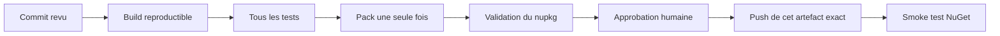

# Stratégie de tests et publication NuGet

> Aucune commande de publication ne doit être exécutée dans le cadre du chantier local sans validation explicite. Le canal candidat et la politique SemVer dépendent de [DEC-001, DEC-009 et DEC-010](decisions.md).

## Diagnostic de la chaîne actuelle

### Publication

Le flux actuel :

1. se déclenche pour tout tag correspondant à `v*` ;
2. restaure, construit et empaquette ;
3. pousse immédiatement les fichiers trouvés vers NuGet avec une wildcard et `--skip-duplicate` ;
4. n'exécute aucun test ;
5. ne compare pas le tag à la version inscrite dans le package.

`Directory.Build.props` fixe `Version` à `1.0.0`. Ainsi, un futur tag `v1.1.0` ne garantit pas la création d'un package `1.1.0`. `--skip-duplicate` peut ensuite transformer cette incohérence en job apparemment réussi.

Autres constats au moment de l'audit :

- la CI générale se déclenche seulement manuellement ;
- la protection de `master` demande une approbation, mais aucun status check obligatoire ;
- le contournement administrateur est permis ;
- aucun environnement GitHub `release` protégé n'est configuré ;
- le secret NuGet est un secret de dépôt de longue durée ;
- le tag `v1.0.0` est léger et non signé ;
- l'artefact est reconstruit dans le job de publication au lieu de promouvoir l'artefact déjà testé.
- aucun `global.json`, lock file NuGet, contrôle de vulnérabilités, seuil de couverture ou validation API/package n'est actuellement imposé ;
- les fichiers de résultats de test portent le même nom sur cinq TFMs et peuvent se remplacer dans les artefacts.

### Historique de preuve de `1.0.0`

La dernière CI normale réussie observée concernait le commit `57395e4` du 18 avril 2026. Le tag `v1.0.0` pointe sur `fd2acda`, qui comporte un ensemble important de changements après ce commit. Les tests live ont échoué le 20 avril, avant la publication du 24 avril.

Cela ne prouve pas que `1.0.0` est défectueux. Cela prouve que l'historique actuel ne permet pas de démontrer que l'artefact publié correspond à un état intégralement validé.

### Métadonnées du package publié

Points positifs observés :

- cinq actifs `net6.0` à `net10.0` présents ;
- package de symboles présent ;
- métadonnées Repository/SourceLink et commit présentes.

Points à corriger ou décider :

- le `.nuspec` publié n'expose ni licence ni tags, car les propriétés de projet utilisées ne sont pas les propriétés NuGet conventionnelles (`PackageLicenseExpression`, `PackageTags`) ;
- pas de notes de version ni d'icône de package ;
- le contenu public du package doit être inspecté automatiquement à chaque candidat.

Ce constat a été vérifié directement dans le `.nuspec` du package `1.0.0` téléchargé depuis NuGet. La présence du fichier `LICENSE` dans le dépôt ou l'affichage d'informations sur le site ne remplace pas une métadonnée de licence dans le package.

## Objectif de la nouvelle chaîne

Un seul artefact immuable doit traverser la chaîne :

Le job de publication ne doit jamais reconstruire. Il télécharge l'artefact testé, vérifie son empreinte, sa version et sa provenance, puis le pousse après approbation.

## Pyramide de tests

### Niveau 1 — Analyse et compilation

À chaque pull request :

- restauration verrouillée ou contrôlée ;
- compilation Release de chaque TFM retenu ;
- avertissements et analyseurs selon une politique documentée ;
- vérification du format et de la documentation XML ;
- recherche de secrets et dépendances vulnérables ;
- validation des liens internes DocFX et génération de la documentation.

### Niveau 2 — Tests unitaires

Portée : validation, options, sérialisation locale, construction d'URI, gestion des erreurs, annulation, DI et durée de vie des clients.

Exigences :

- aucun réseau ;
- horloge, aléatoire et environnement maîtrisés ;
- cas limites de nullabilité, collections vides, enums inconnues et Unicode ;
- exécution sur chaque actif dont l'implémentation conditionnelle diffère.

Les 491 tests réussis constituent une base, mais leur réussite ne remplace pas les niveaux suivants.

### Niveau 3 — Tests du protocole HTTP

Un faux gestionnaire HTTP capture chaque requête. Pour chaque méthode publique, vérifier :

- verbe, base URL, version et chemin ;
- paramètres de chemin et query string ;
- authentification et jetons de téléchargement ;
- type de contenu et corps exact ;
- multipart, formulaire et JSON ;
- redirections et réponse binaire ;
- erreurs HTTP, annulation et libération des flux.

Ce niveau doit détecter les écarts Vendors, Web Downloads et Integration déjà identifiés.

### Niveau 4 — Tests de contrat reproductibles

Ils utilisent des instantanés OpenAPI approuvés, jamais la version distante téléchargée pendant le job. Ils vérifient :

- couverture des opérations ;
- paramètres, emplacement, obligation et format ;
- types de contenu ;
- schémas de requête ;
- classification documentée de chaque opération non exposée.

La [baseline de contrat V2-110](contract-baseline.md) met en œuvre cette
séparation avec la catégorie offline `Contract`. Son monitor distant est
manuel et opt-in : une dérive produit un rapport de revue, mais ne change ni
le code ni les snapshots. V2-110 n'ajoute aucun job, calendrier ou gate CI ;
ces choix restent soumis à DEC-017.

### Niveau 5 — Fixtures de réponse

Ce niveau est conditionnel à DEC-011 et ne fait pas partie de V2-110. Si des
fixtures synthétiques ou anonymisées sont ultérieurement autorisées, elles
pourront valider :

- modèles minimaux et complets ;
- objet contre collection ;
- champs absents, nuls et inconnus ;
- nouvelles valeurs d'enum ;
- enveloppes d'erreur ;
- binaire, PDF et redirection ;
- modèles Search/Relay séparément du Main.

### Niveau 6 — Validation API et package

- validation de la surface publique et du package contre `TorBoxSDK 1.0.0` ;
- cohérence entre actifs TFM ;
- inspection du `.nuspec`, DLL, XML, PDB, SourceLink et dépendances ;
- absence de fichiers de test, secrets, snapshots bruts sensibles ou artefacts inattendus ;
- correspondance exacte entre version attendue, assembly, `.nuspec`, nom de fichier et éventuel tag.

### Niveau 7 — Projets consommateurs

Des projets temporaires installent le `.nupkg` depuis une source locale vide. Ils couvrent chaque environnement retenu dans DEC-002, l'injection de dépendances, le client autonome et les scénarios de sérialisation.

Ils doivent interdire le repli accidentel sur une version de NuGet.org afin de prouver que le candidat est réellement consommé.

### Niveau 8 — Tests live

Deux catégories :

- **lecture seule**, pouvant être exécutée avec un compte dédié si DEC-017
  définit l'autorisation et le mode d'exécution ;
- **mutante**, seulement manuelle, avec ressources isolées et nettoyage contrôlé.

Chaque test live déclare : permissions, coût potentiel, données créées, stratégie de nettoyage et codes de réponse acceptés. Un `403` ne doit pas être traité comme preuve de conformité du modèle.

Les secrets ne sont jamais imprimés. Si DEC-011 autorise ultérieurement des
fixtures de réponse, les réponses capturées doivent passer par anonymisation
avant d'en devenir.

### Niveau 9 — Tests post-publication

Après disponibilité sur NuGet :

- vérifier identité, version, hash et métadonnées ;
- installer depuis NuGet.org dans un projet vierge ;
- compiler au moins un consommateur représentatif ;
- vérifier SourceLink et symboles ;
- tester un appel public sans mutation et la gestion d'une erreur contrôlée ;
- archiver le rapport de publication.

## Organisation CI proposée

Les noms ci-dessous sont illustratifs et ne constituent ni une décision sur la
plateforme ni un planning d'exécution. V2-110 n'ajoute ni workflow, ni
déclencheur, ni gate : DEC-017 doit d'abord définir le périmètre CI, les
autorisations live et une éventuelle cadence.

### `pr.yml`

Déclenchement sur pull request et intégration. Exécute niveaux 1 à 7, sans secret TorBox ni NuGet. Les checks nécessaires deviennent obligatoires sur `master`.

### `contract-watch.yml`

Scénario possible seulement après décision DEC-017. V2-110 fournit aujourd'hui
un monitor local manuel et opt-in qui compare les sources capturées à la
baseline et produit un rapport hors de celle-ci ; il ne pousse ni snapshot ni
changement de code.

### `live-readonly.yml`

Scénario possible seulement après décision DEC-017. Une éventuelle suite live
de lecture devra alors définir son environnement protégé, son compte dédié, ses
autorisations et le traitement de l'indisponibilité externe.

### `release-candidate.yml`

Déclenchement manuel sur un commit exact et une version candidate explicite. Exécute tous les contrôles, crée le `.nupkg` une fois, génère SBOM/attestations si retenus, calcule les hashes et conserve l'artefact.

### `publish.yml`

Télécharge un candidat approuvé, vérifie commit, hash et version, attend l'approbation de l'environnement `release`, puis pousse des chemins de fichiers exacts. Aucune wildcard et aucune reconstruction.

Le comportement face à un package déjà existant doit être un échec explicite, sauf opération de reprise documentée. `--skip-duplicate` n'est pas un contrôle de version.

L'authentification relève de DEC-016 : Trusted Publishing/OIDC limite la durée du jeton ; une clé API reste possible si elle est restreinte au package, au droit de push, avec expiration et rotation.

## Source unique de version

Une seule mécanique doit être choisie et documentée, par exemple :

- version donnée au pipeline candidat, vérifiée puis utilisée par `dotnet pack -p:Version=...` ;
- version dérivée d'un tag strict après que le candidat a été approuvé ;
- outil de versionnement Git configuré et verrouillé.

Quelle que soit l'option, les invariants sont identiques :

- format SemVer validé ;
- tag éventuel exactement égal à `v` + version du package ;
- version d'assembly et d'information cohérentes selon la politique ;
- aucun fichier du dépôt ne peut réintroduire silencieusement `1.0.0` ;
- réexécuter la publication ne fabrique pas un autre binaire.

La mécanique exacte est validée avec DEC-010.

## Procédure de release candidate

### Préconditions

- décisions applicables validées ;
- changelog et guide de migration préparés ;
- snapshots de contrat approuvés ;
- aucune modification locale non suivie dans le worktree d'intégration ;
- commit signé ou règle d'identité conforme à la politique du projet ;
- version libre sur NuGet.

### Construction

1. Partir du commit d'intégration exact.
2. Restaurer dans un environnement propre.
3. Exécuter les niveaux 1 à 7.
4. Calculer la version depuis la source unique.
5. Construire et packer une seule fois.
6. Valider le package contre `1.0.0`.
7. Inspecter son contenu et ses métadonnées.
8. Installer ce fichier dans la matrice consommateurs.
9. Calculer et publier les hashes dans le rapport candidat.
10. Conserver l'artefact sans le reconstruire.

### Rapport candidat

Le rapport contient :

- commit, version, date et environnement SDK ;
- hash SHA-256 du `.nupkg` et du `.snupkg` ;
- résultats de chaque niveau de test ;
- diff API publique contre `1.0.0` ;
- diff OpenAPI et opérations différées ;
- cibles et dépendances ;
- contenu du package ;
- résultats live et dérogations ;
- notes de migration ;
- approbateurs.

### Promotion

Le canal dépend de DEC-009 : fichier local, prerelease NuGet.org, GitHub Packages ou combinaison. Une promotion en version stable exige une approbation distincte et ne reconstruit pas l'artefact.

## Checklist de publication stable

### Avant l'envoi

- [ ] DEC-001, DEC-002, DEC-009 et DEC-010 validées.
- [ ] Version non utilisée sur NuGet.
- [ ] Commit d'intégration protégé et identifié.
- [ ] Tous les checks obligatoires réussis sur ce commit.
- [ ] Rapport de compatibilité accepté.
- [ ] Tests live requis réussis ou dérogation signée.
- [ ] `.nupkg` et `.snupkg` inspectés.
- [ ] Licence, tags, repository, commit, symboles et notes présents.
- [ ] Documentation et migration publiables.
- [ ] Hashes du candidat approuvés.
- [ ] Aucun secret dans les logs ou artefacts.

### Envoi

- [ ] Approbation de l'environnement release.
- [ ] Version du package égale à la version approuvée.
- [ ] Artefact égal au hash approuvé.
- [ ] Chemin exact du package utilisé, sans wildcard.
- [ ] Résultat NuGet conservé dans le rapport.

### Après l'envoi

- [ ] Version visible et métadonnées correctes.
- [ ] Installation depuis NuGet.org réussie.
- [ ] Smoke tests consommateurs réussis.
- [ ] Symboles et SourceLink vérifiés.
- [ ] Release GitHub et changelog liés au bon tag.
- [ ] Surveillance renforcée activée pour la fenêtre décidée.

## Retour après incident NuGet

NuGet ne permet pas de remplacer une version publiée. En cas de problème :

1. arrêter toute promotion ou annonce automatique ;
2. qualifier l'impact et les frameworks touchés ;
3. déprécier et/ou délister la version selon la gravité et la politique du projet ;
4. publier une information claire avec la version sûre ;
5. préparer un correctif avec un nouveau numéro ;
6. refaire toute la chaîne, sans réutiliser le numéro défectueux ;
7. conserver l'analyse post-incident et ajouter un test empêchant la régression.

Le délistage réduit la découverte mais ne retire pas le package des caches ni des projets qui le référencent déjà. Le plan de retour est donc une nouvelle release, pas l'effacement de l'ancienne.

## Travail local et intégration des worktrees

- Le worktree de documentation ne publie rien et ne crée aucun tag.
- Chaque worktree d'implémentation produit son rapport de test local.
- Le worktree d'intégration reçoit les lots dans l'ordre documenté.
- Les tests finaux sont relancés après intégration ; les résultats d'une branche isolée ne suffisent pas.
- Seul le commit d'intégration approuvé peut devenir candidat.
- Un worktree avec changements non suivis n'est jamais supprimé automatiquement.

## Critères d'acceptation de la chaîne

- aucun push NuGet ne peut se produire avant les tests et l'approbation ;
- le job de publication ne compile ni ne packe ;
- tag, package, assembly et rapport portent une version cohérente ;
- l'artefact publié est byte pour byte celui testé ;
- les checks requis couvrent compilation, contrat, API publique et consommateurs ;
- les tests live sont séparés, autorisés et interprétables ;
- la baseline `1.0.0` vient de NuGet ;
- le package contient les métadonnées décidées ;
- un exercice de retour est documenté avant la version stable.

## Sources officielles

- [Validation de packages .NET](https://learn.microsoft.com/dotnet/fundamentals/apicompat/package-validation/overview)
- [Baseline de validation](https://learn.microsoft.com/dotnet/fundamentals/apicompat/package-validation/baseline-version-validator)
- [Compatibilité des packages NuGet](https://learn.microsoft.com/dotnet/standard/library-guidance/nuget-package-compatibility-rules)
- [Suppression et délistage de packages NuGet](https://learn.microsoft.com/nuget/nuget-org/policies/deleting-packages)
- [Versions de packages NuGet](https://learn.microsoft.com/nuget/concepts/package-versioning)
